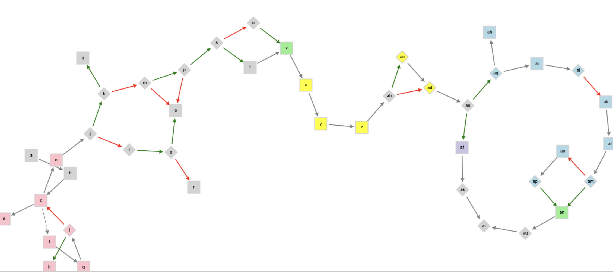
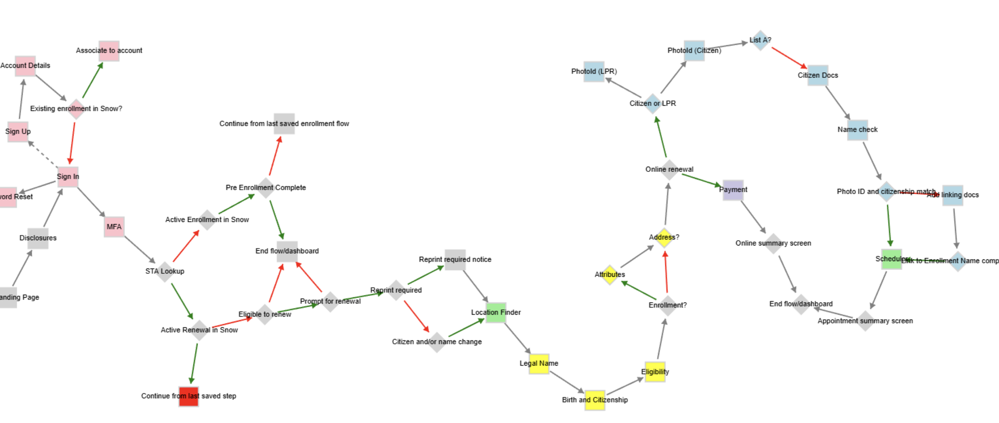

# repo
https://github.com/mulefish/flowchart

# run the force directed graph 
step1: node server.js   
step2: http://localhost:3000/

# TODO: 
Convert to SVG because svg simply looks better than CANVAS5

# Screenshot - letters

# Screenshot - text

