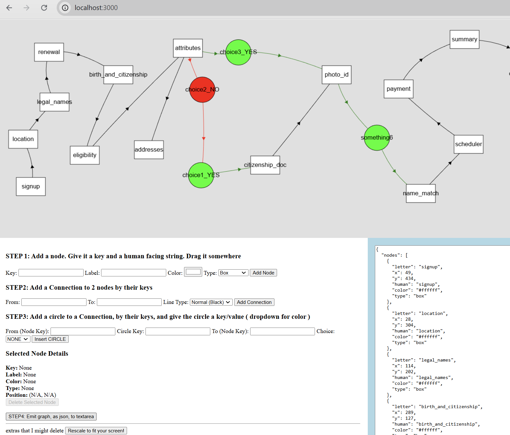

# repo
https://github.com/mulefish/flowchart

# Create a Graph! 
http://localhost:3000/  

Make and save the JSON from the textarea to the 'initialData.json'
# See a graph! 
http://localhost:3000/telos 

Take that JSON from the textarea and overwrite the 'const initalData' with that.

# screenshot

